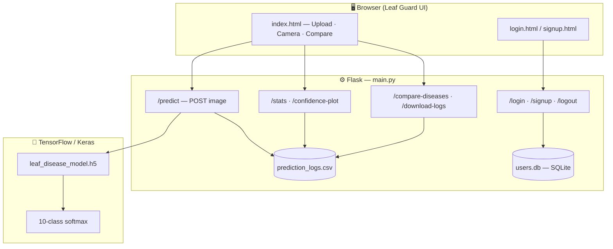
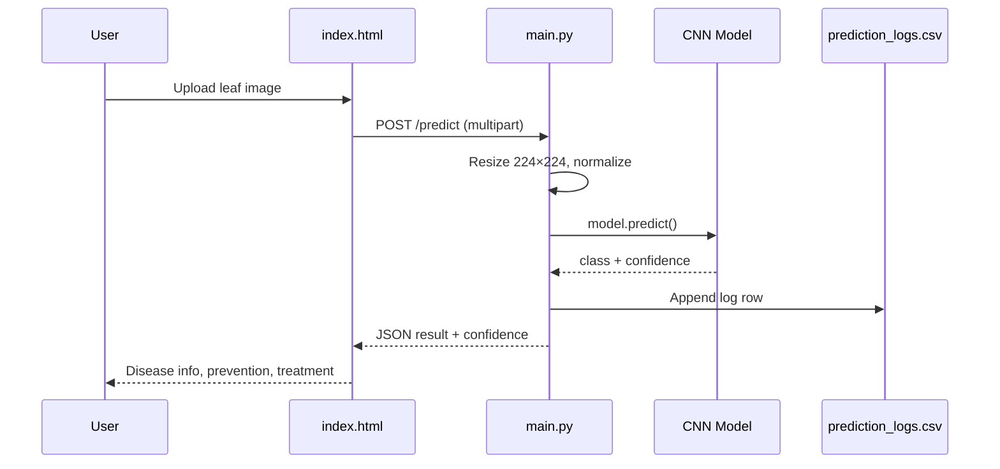

<div align="center">

# 🌿 Leaf Guard — Plant Leaf Disease Detection

[](https://www.python.org/)
[](https://flask.palletsprojects.com/)
[](https://www.tensorflow.org/)
[](LICENSE)

**Upload a leaf image → CNN classifies the disease → get prevention & treatment guidance**

[Features](#-features) · [Architecture](#-architecture) · [Modules](#-modules) · [Quick Start](#-quick-start) · [API](#-api-reference) · [Diseases](#-supported-diseases)

</div>

---

## 📖 About the Project

**Leaf Guard** is an end-to-end machine learning web application that helps farmers and gardeners identify plant leaf diseases from photographs. A deep learning model (CNN / transfer learning with EfficientNet) classifies tomato and related crop leaves into **10 categories**—including healthy plants and nine common diseases. The Flask backend serves predictions over REST, logs every scan to CSV for analytics, and protects routes with session-based authentication. The **Leaf Guard** frontend (Bootstrap 5) lets users upload images or use the device camera, view confidence scores, read curated disease descriptions, compare conditions side-by-side, and keep a local detection history—all without leaving the browser.

---

## ✨ Features

| Feature | Description |
|--------|-------------|
| 🔬 **AI diagnosis** | 224×224 image → normalized tensor → softmax prediction with confidence % |
| 📚 **Care guidance** | Per-disease description, prevention steps, treatments, and symptom lists |
| 🔐 **User accounts** | Sign up, log in, and session-protected dashboard (`auth.py` + SQLite) |
| 📊 **Analytics** | Prediction stats, confidence histograms, disease comparison & monthly trends |
| 📷 **Camera capture** | In-browser `getUserMedia` support on the main dashboard |
| ⚖️ **Disease compare** | Side-by-side modal comparing two diseases and key differences |
| 🕓 **History** | Client-side detection history table with save / view / delete |
| 📥 **Export logs** | Download `prediction_logs.csv` from the server |

---

## 🏗 Architecture



### Prediction flow



---

## 🧩 Modules

Each component has a focused role in the pipeline—from training the model to serving predictions in production.

<details open>
<summary><b>🚀 main.py</b> — Production Flask application</summary>

<br>

The **primary entry point** for running the app (`python main.py`). Configures upload limits (16 MB), creates `static/uploads/`, and loads `leaf_disease_model.h5` at startup. Exposes authenticated routes for prediction, logout, and analytics. Every successful `/predict` call writes timestamp, filename, class, confidence, file path, and `user_id` to `prediction_logs.csv`. Uses **pandas** and **matplotlib** to build JSON stats and base64-encoded charts for the dashboard.

| Route | Method | Purpose |
|-------|--------|---------|
| `/` | GET | Main dashboard (login required) |
| `/predict` | POST | Image upload → inference |
| `/stats` | GET | Aggregate prediction statistics |
| `/confidence-plot` | GET | Confidence distribution chart |
| `/compare-diseases` | GET | Disease counts & monthly trends |
| `/disease-comparison-plots` | GET | Bar + line comparison plots |
| `/download-logs` | GET | CSV export of all predictions |

</details>

<details>
<summary><b>🔐 auth.py</b> — Authentication & user database</summary>

<br>

Manages **SQLite** storage in `users.db` with a `users` table (username, hashed password, email, `created_at`). Passwords are hashed with **SHA-256**. Provides `register_user`, `verify_user`, and a `@login_required` decorator that redirects unauthenticated users to `/login`. Includes JWT token helpers (`generate_token`) for optional API-style auth. The database is auto-initialized when the module is imported.

</details>

<details>
<summary><b>🧠 model.py</b> — Standalone CNN trainer & minimal API</summary>

<br>

An **alternate / legacy** Flask app that can **train from scratch** if `leaf_disease_model.h5` is missing. Defines a custom **Sequential CNN** (three conv blocks + dense head) with augmentation via `ImageDataGenerator`, early stopping, and `best_model.h5` checkpointing. Expects data under `dataset/train` and `dataset/val`. Also exposes a minimal inline HTML page and `/predict` for quick testing without the full Leaf Guard UI.

</details>

<details>
<summary><b>📈 train_model.py</b> — Advanced training pipeline</summary>

<br>

Production-grade training script using **EfficientNetB0** (ImageNet weights) as a frozen backbone, followed by fine-tuning of the last 30 layers. Features include class-distribution plots, **class-weighted** training for imbalance, callbacks (`ModelCheckpoint`, `EarlyStopping`, `ReduceLROnPlateau`), confusion-matrix heatmaps, classification reports, and combined training-history plots. Outputs `best_model.h5` and `leaf_disease_model.h5`.

</details>

<details>
<summary><b>🧪 test_model.py</b> — CLI evaluation & visualization</summary>

<br>

Command-line tool to batch-test images organized by class folder. For each image it reports top-1 and **top-3** predictions, saves horizontal bar charts of all class probabilities, and writes `test_results.csv`. Usage:

```bash
python test_model.py --model leaf_disease_model.h5 --test_dir test_images --output test_results.csv
```

</details>

<details>
<summary><b>🔄 convert_model.py</b> — Model format converter</summary>

<br>

Utility that loads `leaf_disease_model.h5` and exports it to the modern **`.keras`** format under `model/leaf_model.keras` for compatibility with newer Keras saving APIs.

</details>

<details>
<summary><b>🎨 templates/ & static/</b> — Frontend (Leaf Guard UI)</summary>

<br>

| Path | Role |
|------|------|
| `templates/index.html` | Main app — upload, camera, results, disease DB, comparison modal, history table |
| `templates/login.html` | Styled login form with flash messages |
| `templates/signup.html` | Registration with password confirmation |
| `static/css/style.css` | Shared styles (also duplicated as `static/style.css`) |
| `static/js/script.js` | Preview helper (camera stub in separate copy) |

The dashboard embeds a rich **`diseaseInfo`** and **`diseaseSymptoms`** JavaScript object covering all 10 classes, powering instant prevention/treatment text after each prediction.

</details>

<details>
<summary><b>📄 Data & logs</b> — CSV artifacts</summary>

<br>

| File | Purpose |
|------|---------|
| `prediction_logs.csv` | Server-side audit trail of every inference |
| `model_performance.csv` | Schema for aggregated performance metrics |
| `results.csv` | Additional experiment / result records |

</details>

---

## 🦠 Supported Diseases

The model outputs one of **10 classes** (index order used in `main.py`):

| # | Class | Type |
|---|--------|------|
| 0 | Bacterial Spot | Bacterial |
| 1 | Early Blight | Fungal |
| 2 | **Healthy** | — |
| 3 | Late Blight | Fungal |
| 4 | Leaf Mold | Fungal |
| 5 | Septoria Leaf Spot | Fungal |
| 6 | Spider Mites | Pest |
| 7 | Target Spot | Fungal |
| 8 | Tomato Yellow Leaf Curl Virus | Viral |
| 9 | Two-Spotted Spider Mite | Pest |

---

## 🛠 Tech Stack

```
┌─────────────────────────────────────────────────────────────┐
│  Frontend     │  HTML5 · CSS3 · JavaScript · Bootstrap 5   │
│  Backend      │  Flask · Werkzeug · Sessions               │
│  ML           │  TensorFlow / Keras · NumPy · Pillow       │
│  Analytics    │  Pandas · Matplotlib                       │
│  Auth         │  SQLite3 · SHA-256 · PyJWT                 │
│  Training     │  EfficientNetB0 · scikit-learn metrics     │
└─────────────────────────────────────────────────────────────┘
```

---

## 📁 Project Structure

```
Leaf-Disease-Detection--main/
│
├── main.py                 # 🚀 Run this — full web app
├── auth.py                 # 🔐 User registration & login
├── model.py                # 🧠 Alternate CNN trainer + mini API
├── train_model.py          # 📈 EfficientNet training pipeline
├── test_model.py           # 🧪 Batch testing & plots
├── convert_model.py        # 🔄 H5 → .keras converter
├── requirements.txt        # Python dependencies
│
├── templates/
│   ├── index.html          # Leaf Guard dashboard
│   ├── login.html
│   └── signup.html
│
├── static/
│   ├── css/style.css
│   ├── js/script.js
│   └── uploads/            # Created at runtime
│
├── prediction_logs.csv     # Inference history
├── model_performance.csv
└── results.csv
```

> **Note:** Pre-trained weights (`leaf_disease_model.h5`, `best_model.h5`) are **not** in the repo due to size. Download them separately (see below).

---

## 🚀 Quick Start

### Prerequisites

- Python **3.8+**
- **pip**
- ~**4 GB RAM** recommended for model inference
- Git

### 1. Clone the repository

```bash
git clone https://github.com/mondalsoumi/Plant-Leaf-Disease-Detection-and-Classification.git
cd Plant-Leaf-Disease-Detection-and-Classification
```

### 2. Download model weights

Download pre-trained files and place them in the **project root**:

| File | Size (approx.) |
|------|----------------|
| `leaf_disease_model.h5` | ~437 MB |
| `best_model.h5` | ~437 MB |

📦 [Google Drive — Models](https://drive.google.com/drive/folders/1mWfkgC_Fv5h2oau3eKWz34mYCL2Fu84z?usp=sharing)

### 3. Install dependencies

```bash
pip install -r requirements.txt
```

### 4. Initialize authentication (optional)

The database is created automatically when `auth.py` is imported, but you can run:

```bash
python auth.py
```

### 5. Run the application

```bash
python main.py
```

Open **[http://localhost:5000](http://localhost:5000)** → sign up → upload a leaf image → click **Analyze**.

---

<details>
<summary><b>🎓 Train your own model</b></summary>

<br>

Organize images under `dataset/` with one folder per class name (matching `CLASS_NAMES`):

```
dataset/
├── Bacterial Spot/
├── Early Blight/
├── Healthy/
└── ... (other classes)
```

Then run:

```bash
python train_model.py
```

This produces `best_model.h5`, `leaf_disease_model.h5`, `confusion_matrix.png`, and `training_history.png`.

</details>

<details>
<summary><b>📦 Dataset & large artifacts (external)</b></summary>

<br>

Training/testing arrays and plots are hosted externally:

| Resource | Link |
|----------|------|
| Models | [Google Drive — Models](https://drive.google.com/drive/folders/1mWfkgC_Fv5h2oau3eKWz34mYCL2Fu84z?usp=sharing) |
| Dataset (`.npy`, plots) | [Google Drive — Dataset](https://drive.google.com/drive/folders/1uCYCZ61obZEBcUDQeAf9vHfNgXfBqJtT?usp=sharing) |

</details>

---

## 🔌 API Reference

All analytics routes require an active **login session** (cookie).

<details>
<summary><code>POST /predict</code> — Classify a leaf image</summary>

<br>

**Request:** `multipart/form-data` with field `file` (`.png`, `.jpg`, `.jpeg`)

**Response (200):**

```json
{
  "result": "Early Blight",
  "confidence": "86.84%",
  "timestamp": "2025-04-14 12:48:59"
}
```

</details>

<details>
<summary><code>GET /stats</code> — Prediction aggregates</summary>

<br>

Returns total predictions, class distribution, average confidence, and five most recent entries.

</details>

<details>
<summary><code>GET /download-logs</code> — Export CSV</summary>

<br>

Downloads `prediction_logs.csv` as an attachment.

</details>

---

## 🖼 Usage Walkthrough

```
  ┌──────────┐    ┌─────────────┐    ┌──────────────┐    ┌─────────────────┐
  │  Sign up │ →  │ Upload /    │ →  │   Analyze    │ →  │ View disease    │
  │  / Login │    │ Camera      │    │  /predict    │    │ info & history  │
  └──────────┘    └─────────────┘    └──────────────┘    └─────────────────┘
```

1. **Register** or **log in** at `/signup` or `/login`.
2. **Upload** a leaf photo (or open the camera on the dashboard).
3. Click **Analyze** — the CNN returns the disease label and confidence.
4. Read **prevention** and **treatment** steps shown below the result.
5. **Save to History** or open **Compare Diseases** to contrast two conditions.
6. Optionally fetch **stats** and **plots** via the JSON API routes.

---

## ❓ Troubleshooting

| Issue | Solution |
|-------|----------|
| `OSError: No file or directory: leaf_disease_model.h5` | Download model files from Google Drive and place in project root |
| `Please log in to access this page` | Visit `/login` first; protected routes need a session |
| Database errors | Delete corrupted `users.db` and restart the app (auto-recreates) |
| Out of memory | Close other apps; model needs ~4 GB RAM |
| Low accuracy on new images | Retrain with `train_model.py` using your own labeled dataset |

---

## 🤝 Contributing

Contributions are welcome! Fork the repo, create a feature branch, and open a pull request with a clear description of your changes.

---

## 📜 License

This project is licensed under the **MIT License**. See the [LICENSE](LICENSE) file for details.

---

<div align="center">

**Made with 🌱 for smarter, healthier crops**

⭐ Star this repo if Leaf Guard helped you!

</div>
